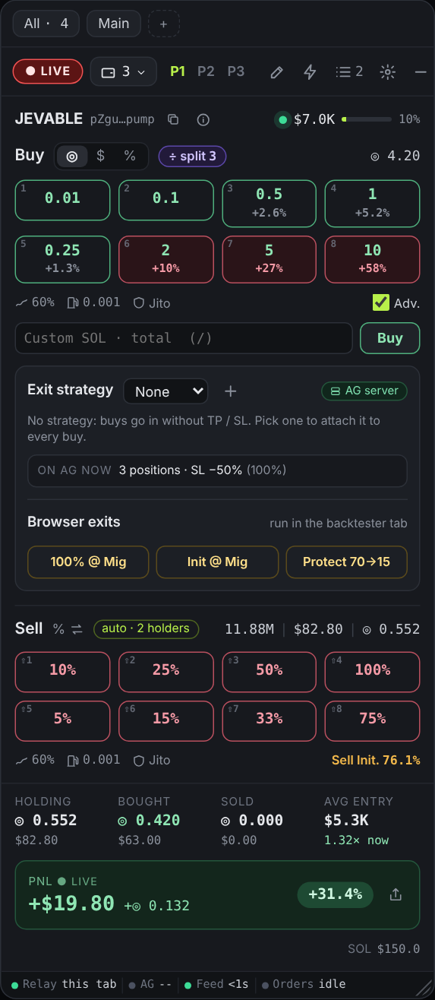
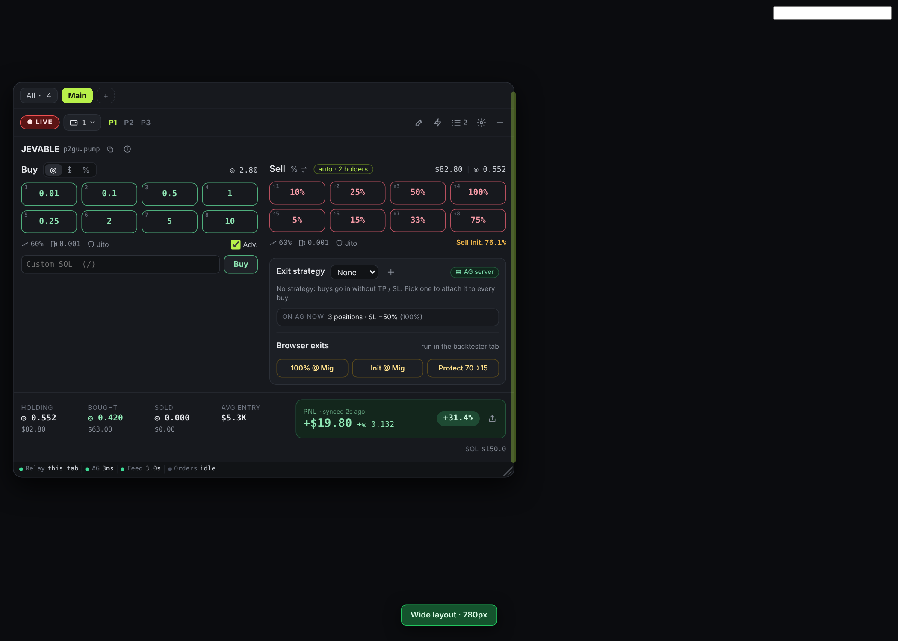
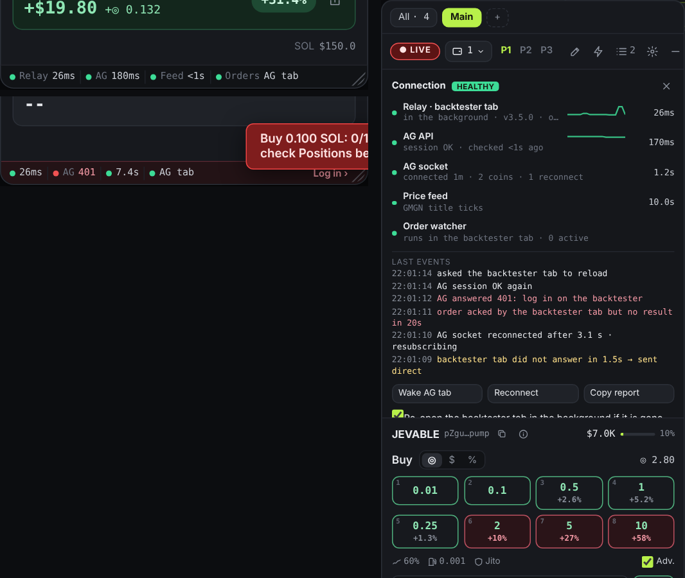
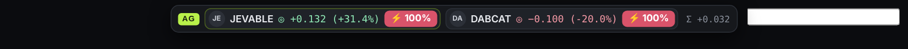
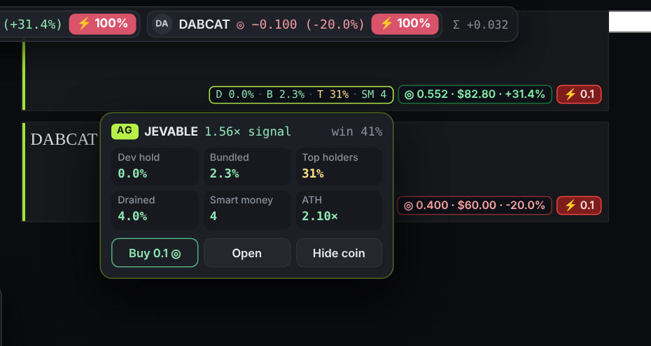

# AG ⚡ Trade Widget

[](https://github.com/roman-t3a/ag-trade-widget/actions/workflows/ci.yml)

A Tampermonkey userscript: a GMGN / Axiom-style floating buy/sell panel that trades through your
**Alpha Gardeners** wallets, on `backtester.alphagardeners.xyz` and `gmgn.ai`.



## Install
1. Install [Tampermonkey](https://www.tampermonkey.net/).
2. Open **[ag-trade-widget.user.js (raw)](https://raw.githubusercontent.com/roman-t3a/ag-trade-widget/main/ag-trade-widget.user.js)**
   and click *Install*. Tampermonkey then updates it from this repo automatically.
3. Keep a **backtester tab** open and logged in: the GMGN widget relays its calls through it.
   Tip: Chrome → Settings → Performance → *Always keep these sites active* → add `backtester.alphagardeners.xyz`.
4. After an update, reload the backtester tab once (the footbar tells you when the two tabs run different versions).

## Features
- Buy in SOL / USD / % of supply, sell in % or SOL; 3 presets edited in place; paper or LIVE.
- Wallet groups, split buys with jitter / stagger, consolidate / split planner.
- Exit strategies (server-side TP / SL on AG), trigger orders (dip, TP at mcap, trailing, DCA), safety rails.
- Live price + PnL (GMGN title ticks + AG socket), average entry, positions, alerts, trade log, share card.
- GMGN cards: AG risk pill + hover peek, quick buy, hide coin (it comes back on a new AG signal).
- Holdings bar at the top of GMGN, wide 2-column layout, hotkeys.
- Connection health footbar (Relay · AG · Feed · Orders) with a diagnostics panel.

## How the tabs talk
```
GMGN tab ──agRpc──▶ Tampermonkey storage ──▶ backtester tab (relay owner) ──▶ AG API / socket
   ▲    ◀─agRpcAck / agRpcRes / agPong──┘          standby backtester tabs ignore calls
   └── no ack in 1.5 s → direct HTTPS to AG (an order is never sent twice)
```

## Code layout
Tampermonkey runs **one file**, so everything lives in `ag-trade-widget.user.js`:

| Part | What |
|---|---|
| `// ==UserScript==` header | matches, grants, `@require` socket.io (pinned + sha256), auto-update URLs |
| `Core` (top of the file) | pure logic, no DOM / GM_*: bonding-curve math, multi-wallet legs, relay rules, AG intel parsing, request bus. Exported to Node for unit tests, nothing else runs there. |
| backtester section | relay owner (lease, ack, ping, session check), AG socket |
| `tradeWidget(env, …)` | the widget itself, shared by both sites |

## Development
```
npm ci                              # eslint + playwright
npx playwright install chromium     # once
npm run check                       # syntax + header checks (single file, grants, version, @require hash)
npm run lint                        # ESLint
npm run test:unit                   # node:test on Core
npm run test:e2e                    # the real script in Chromium against a mocked AG backend; screenshots in test/e2e/shots/
npm test                            # all of the above
```
CI runs the same on every push / PR. To release: bump `@version` in the header **and** `package.json`, add a
`## x.y.z` section to `CHANGELOG.md`, then push a tag `vx.y.z`: the release workflow tests and publishes it.

## Design
`design/` holds the design canvas boards (`*.dc.html` + `canvas.json`) used for the proposals.

## Screenshots
| | |
|---|---|
|  |  |
|  |  |
